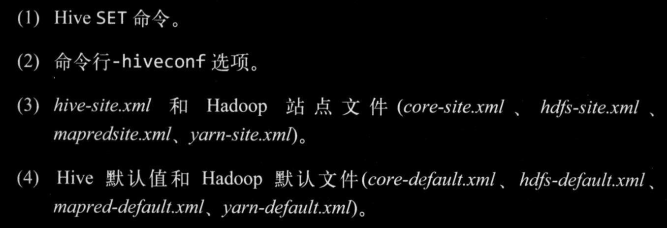
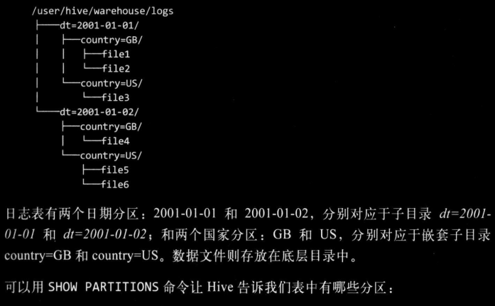

### hive shell操作
这里不说通过hive进入cli，而是非交互模式下运行hive的shell环境
命令行下，`hive -f test.q`可以执行test.q脚本中的HiveQL语句，`hive -e ‘show tables’`可以执行较短脚本
> 交互和非交互都会打印运行时的信息，不过可以通过`-S`强制不输出

hive shell交互环境内也可以通过语句前加上`!`来运行宿主操作系统的命令，一般用来查看hdfs上的文件，省的退出cli

Hive相关属性配置设置及查看问题，像Hive的配置默认是conf目录下有hive-site.xml，hive-default.xml（也可以在hive启动时通过`hive --config xxx/hive-conf`指定在其他位置hive-conf下查找hive-site.xml)，也可以在`hive -hiveconf xxx`启动单一会话时指定配置，或者在hive会话中通过set命令来指定或查看相关配置。这些配置还有优先级关系，如图，优先级递减




### 执行引擎

Hive作业的执行引擎，默认是MapReduce，也支持Spark等，可以通过hive.execution.engine来指定，如`hive> set hive.execution.engine=spark;`

像spark这种，其比MR更加灵活，性能更好。一是因为DAG的引入，job间依赖关系；二是因为spark不会像MR一样把job的中间输出结果存储在hdfs上，而是依据hive规划器的请求将中间输出写到本地磁盘，或者内存中

### 元数据存储Metastore

metastore这是一个单独运行的进程，可以远程，默认是和Hive运行在同一个JVM中，负责服务和后台的数据存储。像表的结构、相关信息就是由metastore服务存储在关系型数据库，表中实际数据存储在hdfs上。

一般是配置一个隔离的MySQL作为metastore，hive也默认提供了一个以本地磁盘为存储的Derby数据库作为metastore（这种方式每次只有一个Derby可以访问磁盘上的数据库文件，所以只支持一个Hive会话）      

### 建表
基本语法：
```sql
create [External] table table_name(
    col col_type,
    ...
)
row format delimited
fields terminated by 'char'
collection items terminated by 'char'
map keys termianted by 'char'
lines terminated by 'char'

;
```
`col_type`，这里的字段类型除了sql中那些类型，像int、string，还有定义array_type(包含同一类型的数组)、map_type(存K-V类型数据)、struct_type(像结构体一样可以存不同类型数据)、union_type(是从指定的几种type中符合其中一种类型即可)。用法：

```
create table p(
    col1 array<string>,
    col2 map<string,int>,
    col3 struct<a:int,b:string,c:double>,
    col4 uniontype<sting,int,float>,
    ...
)
...
```

- 内部表和外部表
  - 内部表是把数据存储在仓库目录中，外部表（External）可以在建表时通过location指定仓库目录以外的位置存储数据
  - 外部表在定义时不会检测location指定的位置是否存在，删除表时也只是删除表结构不会删除实际数据

load是移动数据的操作，只是文件的移动或重命名，速度快，insert是插入由MR作业完成。还有就是Hive在数据加载时不会检查文件中数据格式是否符合表中申明的模式，只有查询时会检查，不匹配的话会返回空 Null


- 分区和分桶

  - 对于文件系统而言，分区只是在表目录下生成了嵌套子目录，其意义在于将查询限定在一定范围内可以加快处理速度

    > 
    >
    > 图片出自《Hadoop权威指南》第四版
    >
    > `show partitions table_name;` 可查看所有分区

  - 分区在建表时通过`Partitioned by(col col_type)`指定，**分区中指定的字段不能和表中定义的字段同名**。在插入数据时通过`Partition(col='xxx')`指定分区名

    > 不能同名，比如上图
    >
    > `select *  from logs where country='US';`这个查询会限定在分区country是us的文件中查询，也就是file356，但如果表中也有一个字段叫country的话语义就有问题，故不可同名

  - 分区中定义的列（字段）是表中正式定义的列，叫做**分区列**，但只作为目录名不是存于数据文件中

  - 桶是将分区加上额外结构组织起来的，为的是**获得更高的查询效率**。像map Join就可以连接两个在相同列上划分了桶的表。其次，**分桶便于抽样**，可以抽取部分数据试运行

  - 分桶在建表时指定要分桶的列和桶的个数，`clustered by(age) into 3 buckets`，Hive在存数据时也是根据对值的hash并对桶数取余插入对应桶中的

    > 还能划分成排序桶，及根据一或多个列排序，可以进一步提供mapJoin的效率
    >
    > `clustered by(age) sorted by(age asc) into 3 buckets` 

  - 设置了分桶的表要插入数据需要设置属性`hive.enforce.bucketing=true`

