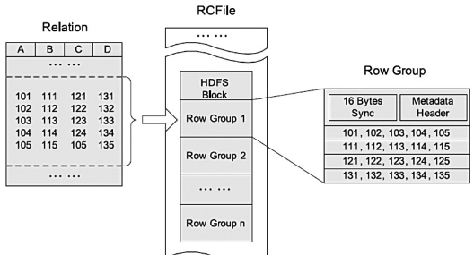

### 参考

- [<https://hive.apache.org/>](https://hive.apache.org/)

- 《Hadoop权威指南》第四版

主要从hql（DDL、DML），Hive函数（UDF）、Hive调优几方面下手

- [Hive DDL数据定义](https://cwiki.apache.org/confluence/display/Hive/LanguageManual+DDL)

- [HIve DML数据操纵](https://cwiki.apache.org/confluence/display/Hive/LanguageManual+DML)
- [Hive UDF用户自定义函数](https://cwiki.apache.org/confluence/display/Hive/LanguageManual+UDF)

### hive shell操作

这里不说通过hive进入cli，而是非交互模式下运行hive的shell环境
命令行下，`hive -f test.q`可以执行test.q脚本中的HiveQL语句，`hive -e ‘show tables’`可以执行较短脚本

> 交互和非交互都会打印运行时的信息，不过可以通过`-S`强制不输出

hive shell交互环境内也可以通过语句前加上`!`来运行宿主操作系统的命令，一般用来查看hdfs上的文件，省的退出cli

Hive相关属性配置设置及查看问题，像Hive的配置默认是conf目录下有hive-site.xml，hive-default.xml（也可以在hive启动时通过`hive --config xxx/hive-conf`指定在其他位置hive-conf下查找hive-site.xml)，也可以在`hive -hiveconf xxx`启动单一会话时指定配置，或者在hive会话中通过set命令来指定或查看相关配置。这些配置还有优先级关系，如图，优先级递减


### 执行引擎

Hive作业的执行引擎，默认是MapReduce，也支持Spark等，可以通过hive.execution.engine来指定，如`hive> set hive.execution.engine=spark;`

像spark这种，其比MR更加灵活，性能更好。一是因为DAG的引入，job间依赖关系；二是因为spark不会像MR一样把job的中间输出结果存储在hdfs上，而是依据hive规划器的请求将中间输出写到本地磁盘，或者内存中

### 元数据存储Metastore

metastore这是一个单独运行的进程，可以远程，默认是和Hive运行在同一个JVM中，负责服务和后台的数据存储。像表的结构、相关信息就是由metastore服务存储在关系型数据库，表中实际数据存储在hdfs上。

一般是配置一个隔离的MySQL作为metastore，hive也默认提供了一个以本地磁盘为存储的Derby数据库作为metastore（这种方式每次只有一个Derby可以访问磁盘上的数据库文件，所以只支持一个Hive会话）      

### 建表


```sql
CREATE [TEMPORARY] [EXTERNAL] TABLE [IF NOT EXISTS] [db_name.]table_name    -- (Note: TEMPORARY available in Hive 0.14.0 and later)
  [(col_name data_type [COMMENT col_comment], ... [constraint_specification])]
  [COMMENT table_comment]

  [SKEWED BY (col_name, col_name, ...)                  -- (Note: Available in Hive 0.10.0 and later)]
     ON ((col_value, col_value, ...), (col_value, col_value, ...), ...)
     [STORED AS DIRECTORIES]
  [
   [ROW FORMAT row_format] 
   [STORED AS file_format]
     | STORED BY 'storage.handler.class.name' [WITH SERDEPROPERTIES (...)]  -- (Note: Available in Hive 0.6.0 and later)
  ]
  [LOCATION hdfs_path]
  [TBLPROPERTIES (property_name=property_value, ...)]   -- (Note: Available in Hive 0.6.0 and later)
  [AS select_statement];   -- (Note: Available in Hive 0.5.0 and later; not supported for external tables)
 
CREATE [TEMPORARY] [EXTERNAL] TABLE [IF NOT EXISTS] [db_name.]table_name
  LIKE existing_table_or_view_name
  [LOCATION hdfs_path];

 
 
constraint_specification:
  : [, PRIMARY KEY (col_name, ...) DISABLE NOVALIDATE ]
    [, CONSTRAINT constraint_name FOREIGN KEY (col_name, ...) REFERENCES table_name(col_name, ...) DISABLE NOVALIDATE 
```


基本语法：
```sql
create [TEMPORARY] [EXTERNAL] table [if not exists] [db_name.]table_name(
    col col_type,
    ...
)
row format delimited	//定义加载数据的格式化
fields terminated by 'char'	//字段用char分隔
collection items terminated by 'char'	//array集合中数据用char分隔
map keys termianted by 'char'	//map中k-v用char分隔
lines terminated by 'char'	//行用char分隔
NULL defined as 'char'	//空缺值用char代替

partitioned by (col_name data_type)
clustered by (col_name1, col_nam2e, ...) [sorted by(col_name [ASC|DESC], ...)] into nums buckets	//分成nums个桶，sorted by是按指定的字段生产排序桶

stored as file_format	//表存储为什么格式
;
```
`col_type`，这里的字段类型除了sql中那些基本类型，像int、string，还有定义array_type(包含同一类型的数组)、map_type(存K-V类型数据)、struct_type(像结构体一样可以存不同类型数据)、union_type(是从指定的几种type中符合其中一种类型即可)。用法：

```
create table p(
    col1 array<string>,
    col2 map<string,int>,
    col3 struct<a:int,b:string,c:double>,
    col4 uniontype<sting,int,float>,
    ...
)
...
```

`file_format`：文件格式，默认是textfile，就是文本格式在配置`hive.default.fileformat`中指定的。还有SEQUENCEFILE(二进制格式存储在hdfs上)、RCFILE、ORC、PARQUET、AVRO、JSONFILE

>- textfile：按行存储，数据不压缩磁盘开销大
>
>  - 其实就是Hadoop中几种输入输出格式
>
>    InputFormat:            `org.apache.hadoop.mapred.TextInputFormat`         
>
>    OutputFormat:           `org.apache.hadoop.hive.ql.io.HiveIgnoreKeyTextOutputFormat` 
>
>- sequencefile：二进制文件，也是按行存储，不过会使用Hadoop的writable接口对k-v数据序列化和反序列化
>
>  - 使用的SequenceFile继承自Hadoop的SequenceFile API，不过Key为空Value存储实际值（MapReduce的map阶段省去了排序）
>  - SequenceFile会比textfile大，多了一些像文件标识、数据格式、校验信息、文件元数据等。可以通过hdfs命令`hdfs dfs -du -h -s xxxx`查看目录下文件大小
>  - SequenceFile不能直接使用load将数据加载到存储格式为SequenceFile的表中，要先创建TextFile的存储格式的表中，然后insert into到存储格式为SequenceFile的表中
>
>- rcfile：Hive中一种专门面向列的数据格式，遵循“**先按列划分，再垂直划分**”的设计理念，我的理解是按列划分，以行存储。当查询Hive不需要查询的列时，它会在IO上跳过这些列。需要说明的是，RCFile在map阶段**从远端拷贝的仍然是整个数据块**，并且拷贝到本地目录后，**RCFile会通过扫描每一个row group的头部定义来判断读取哪些列**，但是在整个HDFS Block 级别的头部并没有定义每个列从哪个row group起始到哪个row group结束。所以在读取所有列的情况下，RCFile的性能反而没有SequenceFile高。
>
>  
>
>  > 参考：<https://my.oschina.net/repine/blog/633160>
>  >
>  > 像RCFILE满足数据仓库的四大关键需求：数据快速加载、快速查询处理、高效存储空间利用率、对高度动态的工作负载模式的强适应性
>  >
>  > **RCFile优点：**具备相当于行存储的数据加载速度和负载适应能力，使用列维度的压缩能够有效提升存储空间利用率，读优化可以避免扫描表格时读取不需要的列
>
>- orc：也是一种列式存储格式，用于降低 Hadoop 数据存储空间和加速 Hive 查询速度。类似parquet但是首先根据行分割整个表，然后在每一个行组内按列存储
>
>  - orc可以大程度节省存储和计算资源，但会在读写时消耗少部分额外CPU资源来压缩和解压缩
>  - orc文件还可以为每一个字段建立轻量级索引 [可参考：HIve优化 orc索引](http://lxw1234.com/archives/2016/04/630.htm)
>  - 总的来说，压缩率最高，性能也高
>
>- avro：用于支持数据密集型的二进制文件格式。它的**文件格式更为紧凑**，**适合读取大量数据**时，Avro能够提供更好的序列化和反序列化性能
>
>- parquet：我最先是在spark学习时接触了这种存储格式

- 内部表和外部表
  - 内部表是把数据存储在仓库目录中，外部表（External）可以在建表时通过location指定仓库目录以外的位置存储数据
  - 外部表在定义时不会检测location指定的位置是否存在，删除表时也只是删除表结构不会删除实际数据

load是移动数据的操作，只是文件的移动或重命名，速度快，insert是插入由MR作业完成。还有就是Hive在数据加载时不会检查文件中数据格式是否符合表中申明的模式，只有查询时会检查，不匹配的话会返回空 Null


- 分区和分桶

  - 对于文件系统而言，分区只是在表目录下生成了嵌套子目录，其意义在于将查询限定在一定范围内可以加快处理速度

    > 
    >
    > 图片出自《Hadoop权威指南》第四版
    >
    > `show partitions table_name;` 可查看所有分区

  - 分区在建表时通过`Partitioned by(col col_type)`指定，**分区中指定的字段不能和表中定义的字段同名**。在插入数据时通过`Partition(col='xxx')`指定分区名

    > 不能同名，比如上图
    >
    > `select *  from logs where country='US';`这个查询会限定在分区country是us的文件中查询，也就是file356，但如果表中也有一个字段叫country的话语义就有问题，故不可同名

  - 分区中定义的列（字段）是表中正式定义的列，叫做**分区列**，但只作为目录名不是存于数据文件中

  - 桶是将分区加上额外结构组织起来的，为的是**获得更高的查询效率**。像map Join就可以连接两个在相同列上划分了桶的表（两张表的桶数成整数倍或因子）。其次，**分桶便于抽样**，可以抽取部分数据试运行

  - 分桶在建表时指定要分桶的列和桶的个数，`clustered by(age) into 3 buckets`，Hive在存数据时也是根据对值的hash并对桶数取余插入对应桶中的

    > 还能划分成排序桶，及根据一或多个列排序，可以进一步提供mapJoin的效率
    >
    > `clustered by(age) sorted by(age asc) into 3 buckets` 

  - 设置了分桶的表要插入数据需要设置属性`hive.enforce.bucketing=true`，因为分桶默认是不开启的

  - 分桶表不能直接通过load加载数据，而是要创建一张中间表tmp_table，将数据load加载到中间表，然后通过`insert into bucket_table select * from tmp_table;`

  - 分桶抽样tablesample语句，`select * from bucket_table tablesample(bucket x out of y [on col])`

    - y是桶数的倍数或因子，比如y=2,4个桶，所以抽4/2=2个桶的数据，然后从第x个桶开始，下一个要抽样桶是x+y。如果y=8,4个桶就是抽半个桶数据。**要注意：x的值必须小于等于y的值**
    - 分桶表后面可以不带on 字段名，不带时默认的是按分桶字段,也可以带，而没有分桶的表则必须带
    - 按分桶字段取样时，因为分桶表是直接去对应的桶中拿数据，在表比较大时会提高取样效率

这里说下，分区最终可以看到目录，分桶而是文件