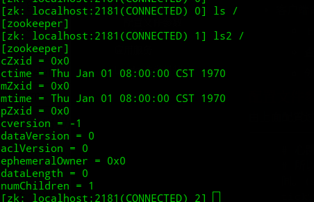
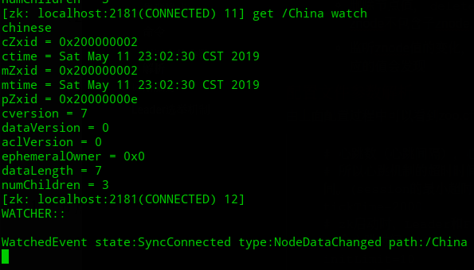
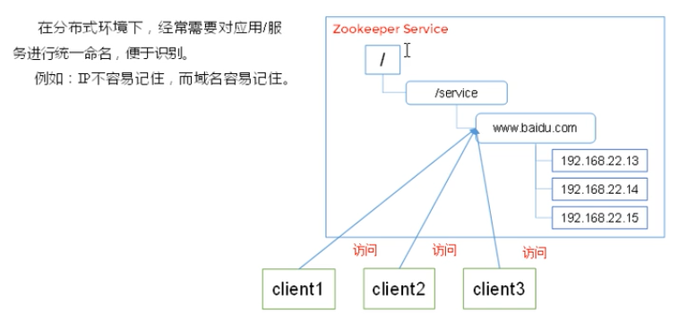
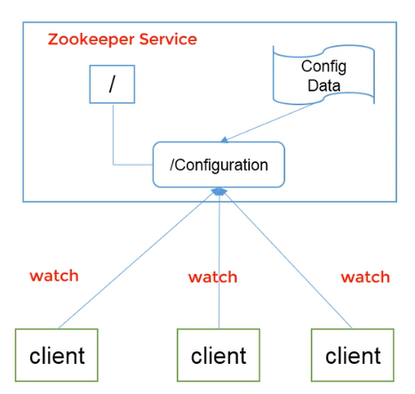
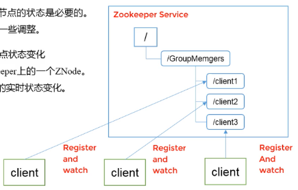
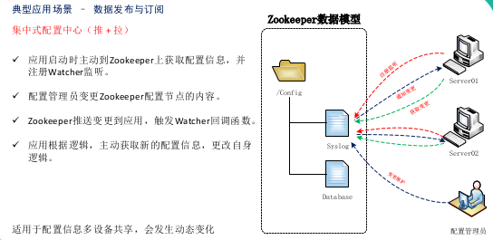
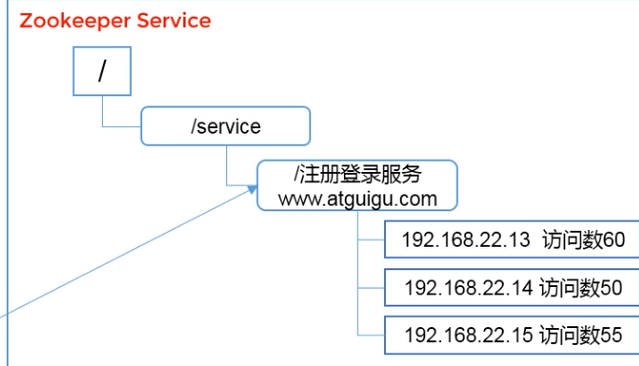
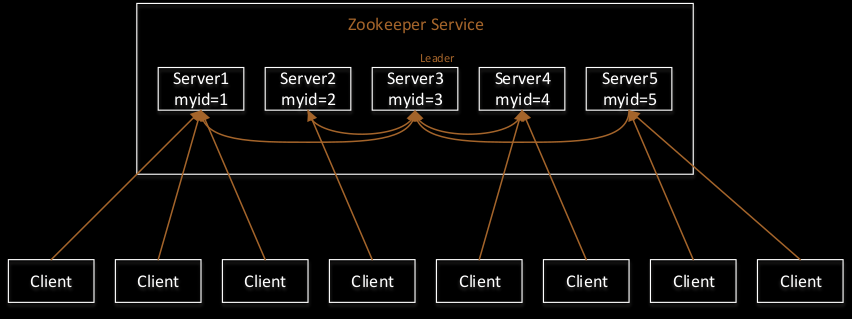

### 概览

> ZooKeeper is a high-performance coordination service for distributed applications. It exposes common services - such as naming, configuration management, synchronization, and group services - in a simple interface so you don't have to write them from scratch. You can use it off-the-shelf to implement consensus, group management, leader election, and presence protocols.
>
> 参考：<http://zookeeper.apache.org/doc/current/index.html>

像文档中说的zookeeper是为**面向分布式**的应用**提供高性能的协调服务**，它提供命名、配置管理、同步和组服务，你可以用它来实现共识、组管理、Leader选举和存在协议、监听器等


### 工作机制


基于观察者模式设计的分布式服务管理框架，负责存储和管理数据，接受观察者的注册。数据就是其他分布式应用的配置文件、节点状态等信息，观察者如图需要获取分布式服务的客户端。所以 zk=数据+通知机制，如果数据的状态发生变化，zk就通知在zk上注册的观察者，观察者也相应做出反应

### 特点

- zk集群由**一个Leade**r，多个Follower组成
- zk集群正常服务的前提是**半数以上的节点存活**，所以zk也适合奇数台服务器
- Leader负责进行投票的发起和决议，更新系统状态
- Follower用于接收Client请求并返回结果给Client，其次是在Leader选举中投票
- 数据保证全局一致，不像hadoop会有副本的概念，zk会在每个server上复制一份相同的数据副本，也保证client连接哪台server都是一样的（单系统映像）
- 数据实时性和原子性，实时性是数据量小同步时间短，原子性是数据更新要么成功要么失败，没有部分结果
- 顺序一致性，同一个 client 的更新请求按其发送顺序依次执行

### zk的数据模型和分层命名空间


如图，类似linux文件系统的树形结构，zk提供一个叫做Hierarchical Namespace（层次化命名空间），名称是由`/`分隔开的路径，命名空间的每一个节点都由唯一路径标识。然后每一个节点叫做znode（通过路径来唯一标识），ZooKeeper 被设计用于存储协调数据: 状态信息、配置、位置信息等所以每个节点数据通常很小（默认存储1MB数据）。znode维护一个包含数据更改、 ACL 更改和时间戳的版本号的属性结构，以支持缓存验证和协调更新。 每次 znode 的数据更改时，版本号都会增加。


znode又分为永久节点（persistent）和临时节点（ephemeral），其内还有顺序之分。默认是永久的

- 持久化目录节点，client和zk断开连接后该znode任然存在
- 持久化顺序编号目录节点，同上但zk会给节点的名称进行顺序编号
- 临时目录节点，client和zk断开连接后会删除znode，**临时节点不能包含子znode**
- 临时顺序目录节点，同上删除znode和节点顺序编号

顺序编号既是在节点名称后加上一个顺序号，顺序号是单调递增的并由父节点维护，可以确保事务操作的先后顺序（可以用作为所有的事件进行全局排序，客户端可以通过顺序号来推断事件顺序）

临时节点的作用可以动态地知道client上下线

### zk下载和安装

我这里为了和之前hadoop集群配对选择了[cdh5.12.1版本](http://archive.cloudera.com/cdh5/cdh/5/)（zookeeper-3.4.5-cdh5.12.1.tar.gz）

#### 单机模式

```
1、zookeeper 的下载和安装
	tar -zxvf zookeeper-3.4.5-cdh5.12.1.tar.gz -C /home/hadoop 【指定解压位置】

2、进入到文件解压缩的路径
	cd /home/hadoop/zookeeper-3.4.5-cdh5.12.1/
3、vi ~/.bash_profile   (配置系统变量)
	export ZK_HOME=/home/hadoop/zookeeper-3.4.5-cdh5.12.1  (路径为zookeeper解压的路径)
	export PATH=$ZK_HOME/bin:$ZK_HOME/sbin:$PATH
	
4、source ~/.bash_profile 使配置生效，然后敲个zk再tab键补全有显示就是成功了

5、进入conf  配置zoo_sample.cfg   拷贝一份zoo_sample.cfg
	cp zoo_sample.cfg zoo.cfg   

6、vim zoo.cfg
	dataDir=/home/hadoop/zookeeper-3.4.5-cdh5.12.1/zkData(提前新建个目录zkData来存放数据)
	
7、然后zkServer.sh start(启动zookeeper)

8、查看进程 jps

9、zkCli.sh(进入zookeeper客户端查看)
```

如图，zkServer启动了一个QuorumPeerMain进程


Client也启动


再次用jps查看，多了一个ZooKeeperMain进程


这里还有一个问题是zk的日志输出，看zkEnv.sh中显示`ZK_LOG_DIR="."，即`在哪里启动服务日志就输出在哪。我参照网上的教程修改了这里，但是任然没有改变输出路径 【**？？？？暂存待解决**】


#### 集群模式

上面的zookeeper还要分发到其他机器上，然后在`zkData/`目录下创建一个myid文件（服务器编号文件），其中是机器在集群中对应的Server ID号（随便取）

并在zoo.cfg上添加

```
server.1=ip1:2888:3888
server.2=ip2:2888:3888
server.3=ip3:2888:3888
```

`server.1`后面这个1是Server ID用来标识该机器在集群中的编号，也对应myid文件中的数，可以随便配，这里也是上面提到的顺序编号。ip1也是server.1的IP地址，其余同理。而2888和3888都是端口号，其中2888是Leader和Follower之间数据副本传输的端口，3888是L挂掉后，L和F之间用来选举投票的端口

配置好后，依次在三台节点上启动服务


查看节点状态是未运行服务，但QuorumPeerMain进程是启动了。再启动第二台节点是的服务，查看状态显示follower


回去看刚刚那台节点状态，服务运行且节点成为leader


原因就是上面说的zk的特点之一：半数以上节点存活才运行服务，这里3台节点，第一台启动时不满足，启动第二台时满足。而且涉及leader选举，第二台投自己一票票数没有过半，就投第一台节点恰好第一台投了自己一票共2票过半成为leader（有时根据启动的情况不一定是这样的，因为如果自己票数不够就默认是投票给id最大的且启动了的机器）

再次启动第三台的服务，并关闭第一台节点的服务，查看第三台状态成为leader


具体leader如何选举后续会聊及


#### 命令

- `zkServer.sh start/stop/status` 启动/退出服务端/查看服务端状态

- `zkCli.sh/quit` 启动/退出客户端

- 客户端命令行操作

  - `help`查看帮助
  - 查看znode包含的内容 `ls path`，详细信息是`ls2 path`。默认是有一个zookeeper节点的，内容为空

  

  - 获取节点的值，`get path [watch]`，watch是监听，但只能监听一次

  - 设置节点的值，`set path data`

  - 创建节点，`create [-e][-s] path data`，-s是含有序列号，-e时临时节点

    - 临时节点创建后挂掉client再次启动可以发现临时节点已被删除

      - 临时节点不能再创建子znode，`Ephemerals cannot have children:`

    - 序列号也就是上面说的顺序编号，如下之前在/China下已经创建了JiangXi、LiaoNing所以GuangZhou的编号是从00000003开始，要是没有节点的话自然是从00000000开始(怪，不是1，搞不清)

      > 

  

  - 删除节点值，`delete path`如`delete /China/JiangXi`，前提保证znode不包含子znode，如果有的话使用`rmr path`递归删除

  - 监听znode值的变化，`get path watch`，然后再另一台机器上修改path对应的值会发现如图 【**但也只是监听一次**】

    

  - 同样可以`ls path watch`监听子节点变化

  - 查看节点状态，`stat path`


#### 配置文件参数解析

由上面配置过程中可以看到zoo.cfg中的参数

```
# 心跳数（心跳间隔），心跳是client和server通信机制，默认2s
# 所以心跳机制的超时时间应该设置最小的session超时时间为两倍心跳时间。(session的最小超时时间是2*tickTime)
tickTime=2000
# zk启动时，Leader和Follower最长同步通信时间（通信时限），如下默认10个心跳时间（10*2s），投票选举新leader的初始化时间
initLimit=10
# zk启动后，Leader和Follower最长同步通信时间（通信时限），如下默认5个心跳时间（5*2s），检测Follower是否死亡
# F死亡的话会从服务器列表中删除该F
syncLimit=5
# 内存数据库快照信息存储的位置，默认更新的事务日志也保存到数据库
dataDir=/tmp/zookeeper
# client连接zk server的端口号
clientPort=2181
```


### 应用服务

- 统一命名服务



- 统一配置管理
  - 像Kafka集群的所有节点的配置信息是一致的，且配置文件的修改可以快速同步到各个节点上，所以使用内置的zk实现
  - 如图，将配置信息写入一个znode，客户端服务器都监听这个znode，一旦配置作了修改zk将通知各个客户端



- 集群管理
  - 像每台机器的运行状态收集，分布式任务的状态汇报，对集群中设备上下线操作等
  - 如图，可以把节点信息写入一个znode（注册）并监听，可以获取节点的实时状态变化



- 服务器节点动态上下线
  - 我感觉这个应该包含在集群管理内部，它所做的也是将服务器状态信息注册到znode上，客户端监听这个znode知道哪些服务器是在线的，哪些下线（死亡），哪些服务器又上线了，就可以选择向哪些服务器发起请求
- 分布式消息同步和协调机制



- 软负载均衡

zk记录每台服务器的访问次数，当client请求服务时选择访问数最少的服务器去处理请求




### Leader选举机制

- 由Paxos协议，必须保证半数以上节点活动才可以起服务
- 没有指定Master/Slave，但会内部选举出一个leader其余是follower
- 如图最新启动，且依顺序启动server12345



- 选举流程
  - 启动server1/2时节点数未过半，选举状态为looking，且服务未运行
  - 启动3时，节点数过半满足了，然后是投票过程。server1先投自己一票，但是票数未过半，结合其他节点交换信息，投id较大的节点一票。假设有启动顺序会投server2，假设server2自己的一票还是未到标。然后server3启动，同样是这么个投票流程，它有3票满足票数过半，立刻成为leader。哪怕server4启动了也不影响server3
  - zk集群运行过程中leader挂机了，也会这么相互通信投票选出新的leader（前提节点数过半）